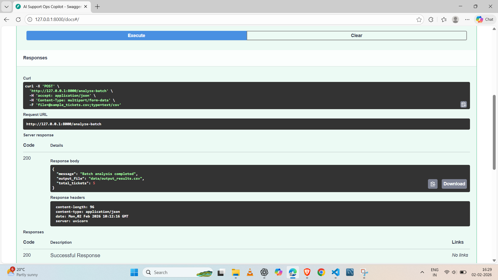

🧠 AI Support Ops Copilot

Applied GenAI POC for Post-Sales & Support Operations

📌 Overview

Support and post-sales teams handle large volumes of unstructured customer tickets with varying urgency, sentiment, and business impact. Manual triage slows response times, causes missed escalations, and makes it difficult to proactively detect churn risk.

AI Support Ops Copilot is a lightweight GenAI-powered proof of concept designed to help support and customer success teams prioritize, route, and respond to tickets faster using structured AI insights.

This project is intentionally built as a rapid prototype suitable for internal pilots and iteration.

🎯 What the AI Does

For each support ticket, the system uses an LLM to automatically generate:

Intent classification
(billing, technical issue, feature request, complaint, general query)

Urgency level
(low / medium / high / critical)

Sentiment analysis
(positive / neutral / negative)

Escalation flag
(whether human escalation is required)

Churn risk signal
(low / medium / high)

Suggested response draft
(professional, empathetic, support-ready reply)

The output is returned as structured JSON and can also be saved as an enriched CSV for ops workflows.

🏗️ Architecture
Support Tickets (CSV / JSON)
            ↓
        FastAPI Backend
            ↓
      Prompted LLM Call
            ↓
     Structured AI Analysis
            ↓
  JSON Response / CSV Output

Design principles

Lightweight & fast to iterate

No heavy infra or model training

Schema-stable outputs for automation

Human-in-the-loop friendly

🧰 Tech Stack

Backend: Python, FastAPI

AI: OpenAI-compatible LLM via OpenRouter

Data: CSV (batch processing)

Utilities: Pandas, Requests

Deployment style: Local / internal pilot

🚀 API Endpoints
1️⃣ Analyze a Single Ticket

POST /analyze-ticket

Input

{
  "ticket_id": "TCK-001",
  "message": "We are extremely unhappy. Your system broke our invoice flow."
}

Output

{
  "ticket_id": "TCK-001",
  "analysis": {
    "intent": "complaint",
    "urgency": "critical",
    "sentiment": "negative",
    "escalation_required": true,
    "churn_risk": "high",
    "suggested_response": "We sincerely apologize..."
  }
}

2️⃣ Analyze Tickets in Batch (CSV)

POST /analyze-batch

Input

Upload a CSV file with columns:

ticket_id

message

Output

Enriched CSV saved to:

data/output_results.csv

Example output columns:

ticket_id,intent,urgency,sentiment,escalation_required,churn_risk,suggested_response

📂 Project Structure
ai-support-ops-copilot/
│
├── app/
│   ├── main.py
│   ├── llm_client.py
│   ├── prompts.py
│   ├── utils.py
│
├── data/
│   ├── sample_tickets.csv
│   └── output_results.csv
│
├── screenshots/
│   ├── batch-analysis.png
│   └── csv-output.png
│
├── README.md
├── requirements.txt
└── .env

▶️ How to Run Locally
1. Install dependencies
pip install -r requirements.txt

2. Set environment variables

Create a .env file:

OPENROUTER_API_KEY=your_api_key_here
OPENROUTER_BASE_URL=https://openrouter.ai/api/v1

3. Start the server
uvicorn app.main:app --reload

4. Open Swagger UI
http://127.0.0.1:8000/docs

🧪 Example Use Cases

Support ticket triage & prioritization

Escalation detection for at-risk customers

Drafting first-response replies for agents

Post-sales operations analytics

Internal AI pilot for CX teams

🔮 Production Considerations (Next Steps)

This project is intentionally a POC. For production use, the following would be added:

Human approval / override loop

Confidence thresholds & fallback logic

Feedback capture for continuous improvement

Monitoring & prompt versioning

Integration with ticketing systems (Zendesk, Freshdesk, Salesforce, etc.)

## 🔍 API Demo (Swagger)

### Batch Ticket Analysis
